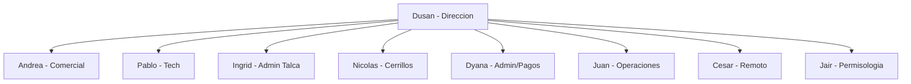

# Herramientas de Diagramas y Flujos

Comparativa de herramientas para representar flujos de trabajo,
organigramas, arquitecturas y grafos. Foco: maxima facilidad para
que Claude genere el diagrama sin fricciones.

| # | Nombre tecnico | Tipo / Enfoque | Ejemplo visual | Link | Requisitos tecnicos | Factibilidad con Claude |
|---|---|---|---|---|---|---|
| 1 | Mermaid.js | Diagramas desde texto (Markdown) | Flujo, secuencia, Gantt, organigrama, pie | [Live Editor](https://mermaid.live/) | Ninguno — renderiza en GitHub, GitLab, Notion, Obsidian, VS Code | ✅ Alta |
| 2 | PlantUML | UML desde texto | Clases, casos de uso, actividad, despliegue | [Online Server](https://www.plantuml.com/plantuml/uml/) | Servidor propio o API online | 🟡 Media |
| 3 | n8n (workflows) | Automatizacion con nodos | Webhook, HTTP, Code, ramas | [n8n.io](https://n8n.io/) | Self-host Docker o cloud | 🟡 Media — Claude genera JSON |
| 4 | Draw.io / diagrams.net | Arrastrar y soltar manual | Organigramas, flujos, arquitectura | [App](https://app.diagrams.net/) | Ninguno — online / Drive / OneDrive | 🔴 Baja |
| 5 | Graphviz (DOT) | Grafos dirigidos desde texto | Arboles, dependencias, grafos | [Online](https://dreampuf.github.io/GraphvizOnline/) | Binario local o web | 🟡 Media |
| 6 | Excalidraw | Pizarra colaborativa dibujada a mano | Wireframes, mapas rapidos | [App](https://excalidraw.com/) | Ninguno, online | 🔴 Baja |
| 7 | D2 | Lenguaje declarativo moderno | Arquitectura, flujos de datos | [Playground](https://play.d2lang.com/) | CLI D2 o online | 🟡 Media |
| 8 | Kroki | Agregador multi-formato | Mermaid, PlantUML, D2, Graphviz via API | [kroki.io](https://kroki.io/) | API publica o server propio | ✅ Alta (si usas Mermaid/PlantUML) |
| 9 | Obsidian Canvas | Nodos + conexiones en Obsidian | Mapas conocimiento, flujos | [docs](https://obsidian.md/canvas) | Obsidian instalado + plugin Canvas | 🔴 Baja |
| 10 | Apache ECharts | Libreria JS de graficos | Lineas, barras, mapas, dispersion | [Examples](https://echarts.apache.org/examples/en/index.html) | Navegador + CDN | 🟡 Media |
| 11 | React Flow (XYFlow) | Libreria React para flujos editables | Flowcharts interactivos, editor | [Examples](https://reactflow.dev/examples) | Proyecto React | 🟡 Media |

## Conclusion

**Para documentacion viva en el repo (Reciclean-Farex): Mermaid.js.**
GitHub renderiza Mermaid nativo, Claude escribe el codigo directo,
sin setup ni binarios. Sirve para organigramas del equipo, flujo de
Diego Alonso en n8n, arquitectura de integraciones, Gantt de tareas,
diagramas de decision.

**Para workflows ejecutables: n8n.** Ya es parte del stack. Claude
disena el JSON, tu lo importas al editor visual.

**Para arquitectura de sistemas moderna: D2.** Mas expresivo que
Mermaid para diagramas complejos con subgrafos y estilos. Requiere
render externo, menos portable que Mermaid.

Las demas opciones solo si el equipo ya las usa. No introducir
herramientas nuevas sin necesidad clara.

## Ejemplo Mermaid — organigrama del grupo

Para probar que funciona en este repo (GitHub renderiza esto):

