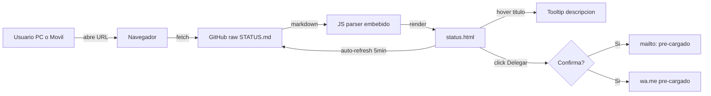
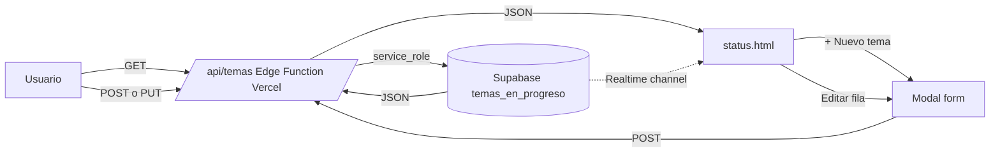
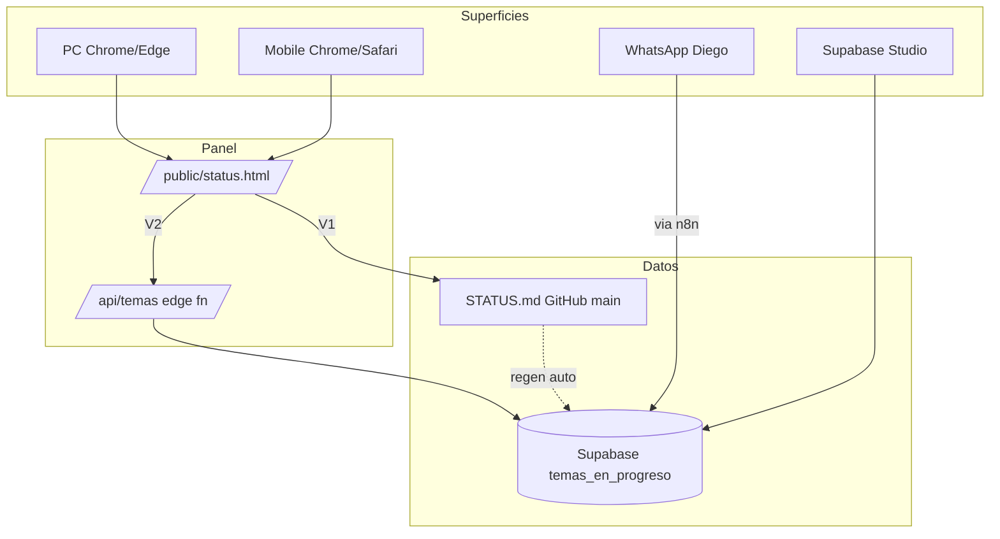

# STATUS — Reciclean-Farex Sistema

> **Snapshot de `temas_en_progreso` (Supabase).** Respuesta canónica a "status / cómo vamos / detalle".
> **Última regeneración:** 22-abr-2026 13:10

---

## Temas activos (11 columnas)

| Código | % | Depto | Responsable | Tema (≤15) | Tiempo | ▶️ | Depende | Delegar a | % ocup. | Banda · Siguiente |
|---|---|---|---|---|---|---|---|---|---|---|
| **I-04** | 90% | Gerencia General | Claude | Tracker temas | 30min | 🔥 Sí | — | Pablo | 0% | 🔍 Revisión · Pablo wirea n8n post 26-abr |
| **I-05** | 30% | Tecnología | Claude | Panel temas | 3h | ⏸️ | I-04 | Pablo | 0% | 📋 Spec · Esperando green light para build |
| **I-03** | 20% | Tecnología | Dusan | Eval BI tools | 2h | ⏸️ | — | Pablo | 0% | 📋 Spec · Contrastar con contexto Reciclean |
| **I-06** | 15% | Gerencia General | Dusan | Ecosistema int. | 1sem | ⏸️ | — | Pablo | 0% | 💡 Diseño · Overlap con I-02/I-03 |
| **I-07** | 10% | Tecnología | Claude | Eval diagramas | 30min | ⏸️ | I-05, I-06 | — | — | 💡 Diseño · ECharts aceptado para I-05 |
| **I-01** | 30% | Tecnología | Claude | Mapa BD + FKs | 1h | ⏸️ | — | — | — | 📋 Spec · Mapear FKs + ER + RLS |
| **I-02** | 10% | Gerencia General | Dusan | Viz informes | 2sem | ⏸️ | I-03 | Ingrid | 0% | 💡 Diseño · Decidir consumidor |

**Total:** 7 activos · 0 superados · 4 con bloqueadores · 3 chats externos ingeridos

---

## Arquitectura Panel V1 (solo lectura)

## Arquitectura Panel V2 (full CRUD)

## Accesos cross-surface

> **Nota:** los diagramas Mermaid renderizan automáticamente cuando ves este archivo en GitHub UI. En raw o en chat se ven como código.

---

## Leyenda bandas (rúbrica %)

| Banda | Rango | Significa |
|---|---|---|
| 💡 Diseño | 0-19% | Idea planteada |
| 📋 Spec | 20-39% | Documento/propuesta |
| 🔨 Build | 40-59% | Implementación activa |
| 🧪 Validado | 60-79% | Pasa smoke tests |
| 🔍 Revisión | 80-99% | Peer review / QA |
| ✅ Superado | 100% | Live + revisión superada |

## Explicación de columnas

| # | Columna | Contenido |
|---|---|---|
| 1 | **Código** | ID único I-NN |
| 2 | **%** | Grado de avance 0-100 |
| 3 | **Depto** | Departamento responsable |
| 4 | **Responsable línea** | Persona que ejecuta ESTA tarea |
| 5 | **Tema (≤15)** | Nombre corto |
| 6 | **Tiempo** | Estimado para terminar |
| 7 | **▶️** | 🔥=ejecutar ahora · ⏸️=espera · ✅=hecha |
| 8 | **Depende** | Códigos de tareas previas requeridas |
| 9 | **Delegar a** | Candidato para aliviar al responsable |
| 10 | **% ocup.** | Ocupación actual del delegado |
| 11 | **Banda · Siguiente** | Estado + próxima acción |

---

## Temas capturados desde chats externos (regla 3A)

| Código | Chat externo | Fecha | Archivo respaldo |
|---|---|---|---|
| I-03 | Gemini — Eval 9 herramientas BI | 22-abr 10:56 | `sesiones/2026-04-22_chat-externo-gemini-herramientas-bi.md` |
| I-06 | Gemini — Ecosistema integrado Diego | 22-abr 12:40 | `sesiones/2026-04-22_chat-externo-ecosistema-integrado.md` |
| I-07 | Gemini — 11 herramientas diagramas/flujos | 22-abr 13:02 | `sesiones/2026-04-22_chat-externo-diagramas-flujos.md` |

**Pattern alert:** 3 chats externos en 1 día con overlap alto entre sí. Consolidar post 30-abr.

---

## Departamentos (10)

1. Gerencia General · 2. Operaciones · 3. Comercial · 4. Abastecimiento · 5. Logística · 6. Finanzas y Administración · 7. Tecnología · 8. Recursos Humanos · 9. Legal y Compliance · 10. Sostenibilidad

---

## Cómo consultar desde cualquier superficie

| Superficie | Método |
|---|---|
| PC Claude Code | Pregunta "status" → `v_status_consolidado` |
| GitHub rendered (bookmark) | [github.com/.../blob/main/STATUS.md](https://github.com/dusanarancibia-cpu/reciclean-sistema/blob/main/STATUS.md) — render Mermaid ✓ |
| Claude.ai / mobile | Fetchea raw URL de este archivo |
| WhatsApp Diego | Pregunta "status" — activo post 26-abr |
| Dashboard interactivo | `reciclean-sistema.vercel.app/status.html` — **build pendiente I-05** |
| Supabase Studio | `SELECT * FROM v_status_consolidado;` |

---

## Fuente de verdad

**Tabla:** `public.temas_en_progreso`
**Vistas:** `v_status_consolidado` · `v_delegaciones_propuestas` · `v_temas_activos` · `v_temas_bloqueados`
**Proyecto Supabase:** `eknmtsrtfkzroxnovfqn`

Si este archivo y la tabla divergen, la tabla manda.

---

_Repo público sin datos sensibles. Contenido comercial/salarios/márgenes nunca se publica aquí — se mueve a endpoint autenticado post 26-abr con edge function Vercel._
