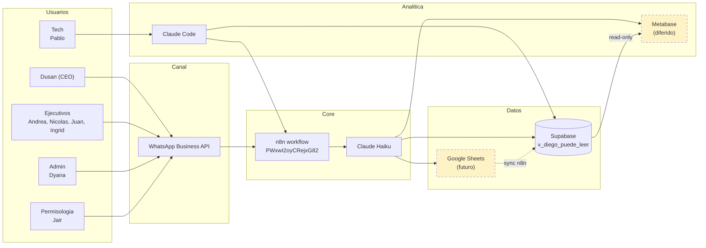
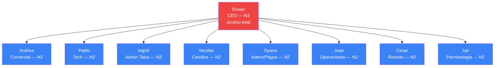

# Ecosistema Diego Alonso — Plan 30 dias

Propuesta de arquitectura con Diego Alonso al centro, stack existente
(Supabase + n8n + WhatsApp + Claude) y 3 integraciones nuevas en orden:
Google Sheets, Mermaid on-demand, Metabase (diferido a junio).

## Estado por herramienta

| Herramienta | Estado | Nota |
|---|---|---|
| Supabase | ✅ operativo | 17+ tablas. Ver TABLAS.md del skill. |
| n8n | ✅ operativo | Workflow Diego PWxwI2oyCRejxG82. Falta N8N_API_KEY. |
| WhatsApp Business API | ✅ operativo | +56 9 6192 6365 |
| Claude Haiku (n8n) | ✅ operativo | Modo v4.2 se aplica 21-abr |
| Claude Code | ✅ operativo | Para Pablo y Dusan |
| Mermaid | ✅ disponible | GitHub renderiza, cero setup |
| Google Sheets | ⚠️ pendiente | API + credenciales + nodo n8n |
| Metabase | ⚠️ diferido | Evaluar junio segun carga Pablo |
| DBeaver | ❌ opcional | Solo si Pablo lo pide |
| ReSimple API | ❌ descartado | Pago, Jair tiene flujo manual |

## Plan 30 dias (Pablo 20h/sem, inicia 26-abr)

| Semana | Foco | Entregables |
|---|---|---|
| 1 | P2 PATCH + P5 bugs 1-28 | Diego v4.2 estable, 0 bugs criticos |
| 2 | Google Sheets + comando registro | "Registra [mat] [kg] [prov]" funciona |
| 3 | Mermaid on-demand | Diego genera diagramas al pedido |
| 4 | Metabase (condicionado) | 3 dashboards con owner, o diferir |

Regla dura: no pasar a semana N+1 hasta que N este cerrada y Diego
lleve 3 dias estable.

## Checklist Pablo 26-abr (tareas max 2h)

- [ ] T1 (1h) Revisar estado Diego LIVE + logs n8n 7 dias
- [ ] T2 (2h) P2 PATCH: backup + diff + PUT + smoke
- [ ] T3 (2h) P5 bugs 1-10: loops + parser menus
- [ ] T4 (2h) P5 bugs 11-20: fix "registrado para briefing" + alias sucursales
- [ ] T5 (2h) P5 bugs 21-28: identidad + audios opus
- [ ] T6 (1h) Google Sheets API credentials + conectar en n8n
- [ ] T7 (2h) Nodo n8n "Sheets leer celda" + test Dyana
- [ ] T8 (2h) Nodo n8n "Sheets append fila" + test Nicolas
- [ ] T9 (2h) Comando Diego "Registra compra ..."
- [ ] T10 (1h) Pruebas con Andrea + Ingrid + Nicolas

Total estimado: 17h. Margen de 3h para imprevistos en la primera
semana.

## Metricas de utilidad Diego

| Metrica | Mes 1 | Mes 3 |
|---|---|---|
| % consultas resueltas sin escalar | >60% | >80% |
| Tiempo respuesta promedio | <30s | <15s |
| Bugs criticos abiertos | <3 | 0 |
| Entrevistas v4.2 completadas/sem | >5 | >15 |
| procesos_empresa nuevos/mes | >10 | >30 |
| Mentiras detectadas ("alerto a X") | 0 | 0 |

Fuentes: tabla conversaciones + casos_asistente + bugs_asistente +
sesiones_entrevista.

## Riesgos

1. **Diego suma capacidades antes de arreglar core** -> congelar
   comandos nuevos hasta P5 cerrado y 7 dias estable.
2. **Google Sheets crea BD paralela** -> Sheets solo UI, n8n replica
   auto a Supabase (fuente de verdad unica).
3. **Metabase = cementerio de dashboards** -> max 3 dashboards con
   owner, revision mensual, archivar si >30 dias sin visita.
4. **Equipo se siente vigilado** -> comunicar que registra y que no;
   respetar "pausar"; casos-diego NO indexa RAG.
5. **Pablo sobrecargado** -> tope 20h/sem. Si se pasa, Metabase a
   junio.

## Diagrama arquitectura (data flow)

## Organigrama + niveles acceso Diego

Leyenda de acceso (ver clasificacion_informacion):
- N3 (Dusan): publico + operativo + restringido + confidencial.
- N2 (resto): publico + operativo unicamente.

## Recomendacion final

**Reducir scope.** Orden estricto:
- Semanas 1-2: estabilizar Diego (P2 + P5). Nada mas.
- Semanas 3-4: Google Sheets + Mermaid. Alto impacto, bajo costo.
- Junio o despues: Metabase, si hay carga y el equipo lo pide.
- Nunca (por ahora): ReSimple API (costo no justifica).
