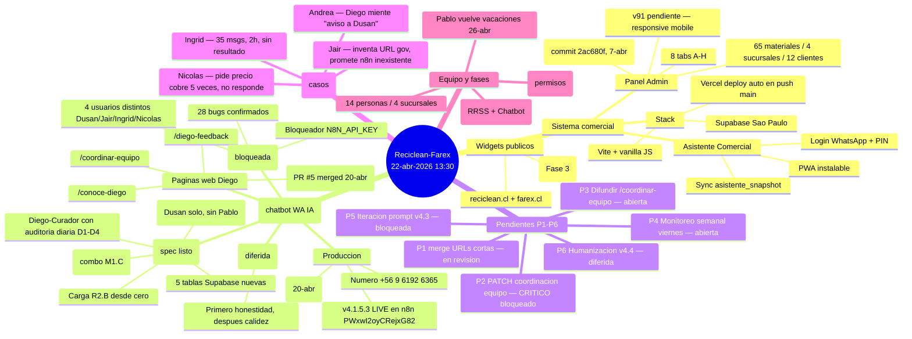

# Mapa Mental — Progreso Reciclean-Farex

> **Corte:** miercoles 22-abr-2026, ~13:30 hrs Chile
> **Branch:** `claude/create-progress-mindmap-OeGIh`
> **Objetivo:** vista unica del estado del sistema, Diego Alonso, pendientes y evidencia de campo.

---

## Vista rapida (mermaid — GitHub la renderiza)



---

## Vista arbol (ASCII por si mermaid no carga)

```
RECICLEAN-FAREX — 22-abr-2026 13:30
│
├── 1. SISTEMA COMERCIAL (produccion estable)
│   ├── Panel Admin v90          commit 2ac680f, deploy 7-abr
│   │   ├── 8 tabs: Carga / Alias / Precios / Historial
│   │   │          Publico / Usuarios / Revisor / Empresa
│   │   ├── 65 materiales · 4 sucursales · 12 compradores
│   │   └── Proximo: v91 responsive mobile
│   ├── Asistente Comercial      login WA + PIN
│   │   └── Sync via asistente_snapshot (Realtime)
│   └── Widgets publicos          reciclean.cl + farex.cl
│
├── 2. DIEGO ALONSO — chatbot WhatsApp IA
│   │
│   ├── 2a. LIVE ahora
│   │   ├── v4.1.5.3 en n8n workflow PWxwI2oyCRejxG82
│   │   ├── Renombrado "Diego" → "Diego Alonso" (20-abr)
│   │   └── Anuncio one-shot aprobado por Dusan
│   │
│   ├── 2b. Paginas web Diego (todas LIVE)
│   │   ├── /conoce-diego         presentacion
│   │   ├── /coordinar-equipo     como pedir mensajes
│   │   ├── /diego-feedback       recoger feedback
│   │   ├── /diego-faq            preguntas frecuentes
│   │   └── 6 URLs cortas (PR #5 mergeada 20-abr)
│   │
│   ├── 2c. v4.2 Modo Entrevista — spec CERRADO
│   │   ├── 5 tablas Supabase: procesos_empresa +
│   │   │   entrevistas + borradores_curador + ...
│   │   ├── Diego-Curador IA con auditoria D1-D4
│   │   ├── Mensaje M2 al equipo (firma M1.C combo)
│   │   ├── Carga R2.B desde cero, 30 dias inversion
│   │   └── EJECUCION 21-abr 08:00-10:00 hrs (Dusan solo)
│   │
│   ├── 2d. v4.3 BUGS — 28 confirmados, bloqueada
│   │   ├── Criticos: Diego miente "aviso a Dusan"
│   │   │             No parsea A/B/C tras su propio menu
│   │   │             Loops de saludo (Ingrid: 7 veces 1h)
│   │   │             Alucina reglas ("Talca no opera")
│   │   │             Inventa URLs gov (retc.mma.gob.cl)
│   │   ├── Validado con 4 usuarios distintos
│   │   └── Bloqueador: falta N8N_API_KEY
│   │
│   └── 2e. v4.4 Humanizacion — DIFERIDA
│       └── Razon: si Diego miente + tira chistes = peor
│
├── 3. PENDIENTES P1-P6
│   ├── P1  merge URLs cortas          EN REVISION
│   ├── P2  PATCH coordinacion equipo  CRITICO BLOQUEADO (N8N key)
│   ├── P3  Difundir /coordinar-equipo ABIERTA (3 variantes WA)
│   ├── P4  Monitoreo semanal viernes  ABIERTA
│   ├── P5  Iteracion prompt v4.3      BLOQUEADA (N8N key)
│   └── P6  Humanizacion v4.4          DIFERIDA
│
├── 4. EVIDENCIA DE CAMPO (20-abr, disparador de P2/P5)
│   ├── casos-diego/20260420-ingrid.md   35 msgs · 2h · sin resultado
│   ├── casos-diego/20260420-jair.md     URL gov inventada + n8n falso
│   ├── casos-diego/20260420-nicolas.md  precio cobre pedido 5 veces
│   └── (Andrea) mentira "aviso a Dusan" — patron sistemico
│
├── 5. EQUIPO Y CONTEXTO
│   ├── 14 personas · 4 sucursales
│   ├── Puerto Montt NO operativa (permisos)
│   ├── Pablo de vacaciones · regresa 26-abr
│   └── Fase 4 EN CURSO: RRSS automaticas + Chatbot WA IA
│
└── 6. SEMANA QUE VIENE (22 → 28 abr)
    ├── Hoy 22-abr      revisar resultado implementacion v4.2 de ayer
    ├── Vie 24-abr      monitoreo semanal Diego (P4)
    ├── Sab 25-abr      ventana para difundir P3
    └── Lun 26-abr      Pablo vuelve · arrancar P2/P5 con N8N key
```

---

## Hitos de los ultimos 4 dias

| Fecha | Hito |
|-------|------|
| **19-abr** | Pagina `/diego-presentacion` + FAQ + feedback + ejemplos |
| **20-abr AM** | PR #5 abierto con URLs cortas + pagina `/coordinar-equipo` |
| **20-abr tarde** | Evidencia Andrea/Ingrid/Jair/Nicolas → 28 bugs catalogados |
| **20-abr tarde** | Cambio nombre "Diego" → "Diego Alonso" aprobado por Dusan |
| **20-abr noche** | Spec v4.2 Modo Entrevista cerrado + guia implementacion |
| **21-abr 08-10h** | Ventana ejecucion v4.2 (Dusan solo, sin Pablo) |
| **22-abr hoy** | Consolidar: revisar post-implementacion + preparar P2/P5 |

---

## Frentes que dependen de una sola accion

**Desbloquear con `N8N_API_KEY`:**
- P2 (PATCH coordinacion equipo — CRITICO)
- P5 (fix de los 28 bugs)
- P6 (humanizacion, pero primero P2+P5)

**Desbloquear con merge a `main`:**
- P1 (URLs cortas listas, falta apretar boton)
- P3 (difusion depende de URLs vivas)

**Desbloquear con Pablo vuelve 26-abr:**
- Bug #4 (variable `{nombre}` sin renderizar)
- Bug #9 (Diego usa URLs largas en vez de cortas)
