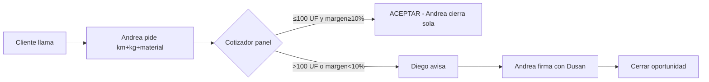

# BANDEJA PABLO — Tab "📖 Manual" en panel-rdo

**Firma:** `D-MANUAL-EN-PANEL-001` — Dusan, 2026-05-25 AM
**Repo objetivo:** `reciclean-sistema/public/panel-rdo.html` (fuente única)
**Estimado total:** 5-7 hr
**DDL:** opcional (1 tabla nueva si no se reutiliza `panel.diego_bandeja`).

---

## Resumen ejecutivo (1 párrafo)

El manual operativo (23 procesos × 14 personas) firmado anoche como `D-MANUAL-EQUIPO` hoy vive en `reciclean-sistema/public/MANUAL-OPERATIVO-EQUIPO.md` — afuera del panel. Dusan firmó hoy 25-may que **el manual debe vivir DENTRO del panel** y ser accesible siempre, con texto + diagramas visuales lado a lado, vista personalizada por persona, y comentarios in-app. El equipo no busca el manual afuera. Esta bandeja arma el tab "📖 Manual" en panel-rdo.

---

## El cambio en 3 ideas

| Antes (hoy) | Después (esta spec) |
|---|---|
| Manual = archivo `.md` en GitHub | Manual = tab "📖 Manual" en panel-rdo sidebar |
| Andrea/Cony lo leen una sola vez (cuando llega el link) | Lo abren cuando quieren, desde su sesión |
| Solo texto | Texto + diagrama visual lado a lado por proceso |
| Sin feedback estructurado | Botón "💬 Comentar" por proceso → bandeja Dusan |

---

## Arquitectura propuesta

### 1. Nuevo tab en sidebar v4

```
📖 Manual    ← nuevo, visible para TODOS los roles
```

Ubicación: después de "Comunicados" en el sidebar. No requiere permiso especial — todo el equipo lo ve.

### 2. Layout de la página

```
┌────────────────────────────────────────────────────────────────────┐
│ 📖 Manual operativo del equipo                    [tu perfil: T11] │
├────────────┬──────────────────────────────────────────────────────┤
│ ÍNDICE     │  ← Mostrando 7 funciones de Andrea (T11) ─ resaltadas│
│ (sidebar)  │                                                       │
│            │  ┌─────────────────────────────┬───────────────────┐ │
│ Filtros:   │  │ 1. COTIZAR retiros          │   [Diagrama]      │ │
│ ▼ Por mí   │  │                             │   flujo paso a    │ │
│ ▼ Todos    │  │ Cómo: entrás al Cotizador…  │   paso del        │ │
│ ▼ Por rol  │  │ Ejemplo: "Cotizá Pincore…"  │   Cotizador       │ │
│            │  │ Escalas: si >100 UF o…      │                   │ │
│ Procesos:  │  │                             │   (Mermaid SVG)   │ │
│ - 1. Cotizar│ │ [💬 Comentar este proceso]  │                   │ │
│ - 2. Cerrar │ └─────────────────────────────┴───────────────────┘ │
│ - 3. Alta   │  ┌─────────────────────────────┬───────────────────┐ │
│ - 4. Cobranza│ │ 2. Cerrar negocio con cliente │ [Diagrama]      │ │
│ - 5. IC     │  │ ...                           │                  │ │
│ - 6. Datos  │  └─────────────────────────────┴───────────────────┘ │
│ - 7. NC     │                                                       │
│            │   ... resto de los 7 procesos ...                     │
│ Otros roles │                                                       │
│ (colapsado) │                                                       │
└────────────┴──────────────────────────────────────────────────────┘
```

### 3. Filtros (panel izquierdo)

| Filtro | Comportamiento |
|---|---|
| **Por mí** (default) | Solo los procesos donde la persona es protagonista (resaltados verde). El resto colapsado al final. |
| **Todos** | Los 23 procesos en orden, mismo formato. |
| **Por rol** | Selector: Comercial / Operaciones / Admin / Choferes / etc. — muestra solo los procesos del rol elegido. |

La identidad de la persona se saca de `rf_session` (email) → cruzar con `panel.dotacion` para obtener `id_interno` (T01-T14) y `rol`.

### 4. Contenido del manual

**Fuente:** `reciclean-sistema/public/MANUAL-OPERATIVO-EQUIPO.md` (ya commiteado).
**Render:** parsear el .md a HTML con `marked.js` (~28KB, ya en CDN) o un parser simple inline. Aplicar CSS Reciclean (visual_standard_v1).

**Estructura esperada del .md:** cada proceso es un `## N. NOMBRE` con secciones internas (`Cómo`, `Ejemplo`, `Cuándo escalás`). Asegurar consistencia — si no, ajustar el .md antes.

### 5. Diagramas visuales (la parte nueva)

**Opción recomendada: Mermaid** (~75KB minified, MIT, vanilla JS, sin React).

Por cada proceso, un diagrama embebido tipo:



Los 23 diagramas hay que escribirlos (no se generan solos del texto). Sugerencia: que Pablo prepare un template y Dusan revise/firme los 4-5 más críticos primero (Cotizar, Cerrar, Alta negocio, Cobranza, Inteligencia Competitiva).

**Storage de diagramas:** archivos `.mmd` (o bloques `mermaid` inline en el .md). Simple.

### 6. Botón "💬 Comentar este proceso"

Click → modal con:
```
┌──────────────────────────────────────┐
│ Comentar: 1. Cotizar retiros         │
├──────────────────────────────────────┤
│ ¿Qué está mal, falta o sobra?        │
│ ┌──────────────────────────────────┐ │
│ │ [textarea]                       │ │
│ └──────────────────────────────────┘ │
│ ¿Tipo?                                │
│ ◯ Error                               │
│ ◯ Falta info                          │
│ ◯ Sobra info                          │
│ ◯ Idea de mejora                      │
│                                       │
│         [Cancelar] [Enviar a Dusan]  │
└──────────────────────────────────────┘
```

Submit → INSERT en tabla.

**Opción A (recomendada):** crear tabla nueva `panel.manual_feedback`:
```sql
CREATE TABLE panel.manual_feedback (
  id UUID PRIMARY KEY DEFAULT gen_random_uuid(),
  proceso_num INT NOT NULL,           -- 1..23
  proceso_nombre TEXT NOT NULL,
  remitente_email TEXT NOT NULL,      -- FK lógica a panel.dotacion
  comentario TEXT NOT NULL,
  tipo TEXT CHECK (tipo IN ('error','falta','sobra','idea')),
  estado TEXT DEFAULT 'pendiente' CHECK (estado IN ('pendiente','aplicado','descartado')),
  respuesta_dusan TEXT,
  created_at TIMESTAMPTZ DEFAULT now(),
  resuelto_at TIMESTAMPTZ
);

ALTER TABLE panel.manual_feedback ENABLE ROW LEVEL SECURITY;
CREATE POLICY "manual_feedback_lectura_propia" ON panel.manual_feedback
  FOR SELECT USING (remitente_email = auth.email() OR auth.email() = 'dusan.arancibia@gmail.com');
CREATE POLICY "manual_feedback_insert_propio" ON panel.manual_feedback
  FOR INSERT WITH CHECK (remitente_email = auth.email());
CREATE POLICY "manual_feedback_update_dusan" ON panel.manual_feedback
  FOR UPDATE USING (auth.email() = 'dusan.arancibia@gmail.com');
```

**Opción B (más rápido):** reutilizar `panel.diego_bandeja` con `tipo='manual_feedback'` y `referencia=<proceso_num>`. Menos limpio pero 0 DDL.

Pablo decide. Recomendación: A si hay tiempo (~30 min DDL extra), B si Pablo prefiere quick win.

### 7. Vista Dusan: revisar feedback

Sub-tab dentro de Manual (solo Dusan): "💬 Feedback del equipo" — listado de comentarios pendientes con botones [Aplicar al manual] / [Descartar con razón] / [Responder al remitente].

Cuando Dusan aplica un comentario, deja una nota tipo "ajustado 25-may por feedback de Andrea T11" en el .md fuente. Versionado natural via git.

---

## DoD (Definition of Done)

- [ ] Tab "📖 Manual" agregado al sidebar v4 panel-rdo.html.
- [ ] Parser markdown vivo: el contenido de `MANUAL-OPERATIVO-EQUIPO.md` se ve renderizado dentro del tab (no iframe).
- [ ] Filtro "Por mí" cruza `rf_session.email` con `panel.dotacion` y resalta los procesos de esa persona.
- [ ] Filtro "Todos" + "Por rol" funcionan.
- [ ] Al menos 5 diagramas Mermaid embebidos (los más críticos): Cotizar / Cerrar / Alta negocio / Cobranza / Inteligencia Competitiva.
- [ ] Botón "💬 Comentar" por proceso abre modal con campos (textarea + tipo).
- [ ] Submit guarda en `panel.manual_feedback` (Opción A) o `panel.diego_bandeja` (Opción B).
- [ ] Sub-tab "💬 Feedback del equipo" visible solo para Dusan, lista pendientes con acciones.
- [ ] Mobile responsive (test en 375px): el panel diagrama colapsa abajo del texto.
- [ ] Validación mobile + desktop por Dusan en preview Vercel.
- [ ] PR a `main` con cuerpo apuntando a esta bandeja.
- [ ] Tras merge a `main`, esperar firma Dusan para `main → prod`.
- [ ] Post-prod: avisar Dusan para que mande WhatsApp Andrea apuntando al tab.

---

## Rollback

Localizado: revertir el PR. Si Opción A (tabla nueva): revertir migración con `DROP TABLE panel.manual_feedback CASCADE`. Si Opción B: limpiar registros con `DELETE FROM panel.diego_bandeja WHERE tipo='manual_feedback'`.

---

## Coordinación

- **PC2 Pablo:** ejecuta los 7 puntos, mergea a `main`, avisa para que Dusan firme promoción a `prod`.
- **PC1 Dusan (este PC):** post-deploy avisa Andrea + revisa los primeros feedbacks que lleguen.
- **Andrea:** primera revisora del manual desde el tab (en vez del WhatsApp con link externo que se postergó).

---

## Dependencias

- Ninguna estricta. Pablo puede empezar cualquier momento.
- Si está en el sprint del FAB Diego (D-DIEGO-FAB-MEJORAS-001, ~2-3 hr), conviene cerrar ese primero para no mezclar PRs.

---

**Firmado** D-MANUAL-EN-PANEL-001 · Dusan Arancibia · 2026-05-25
