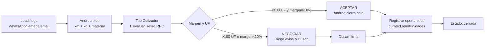
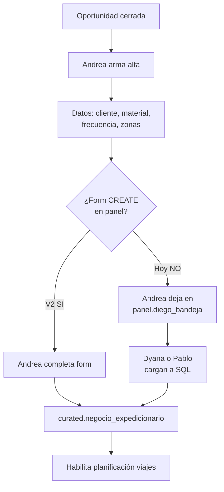
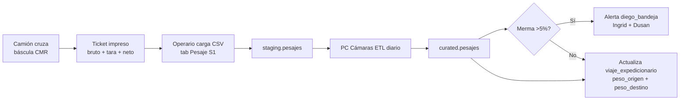
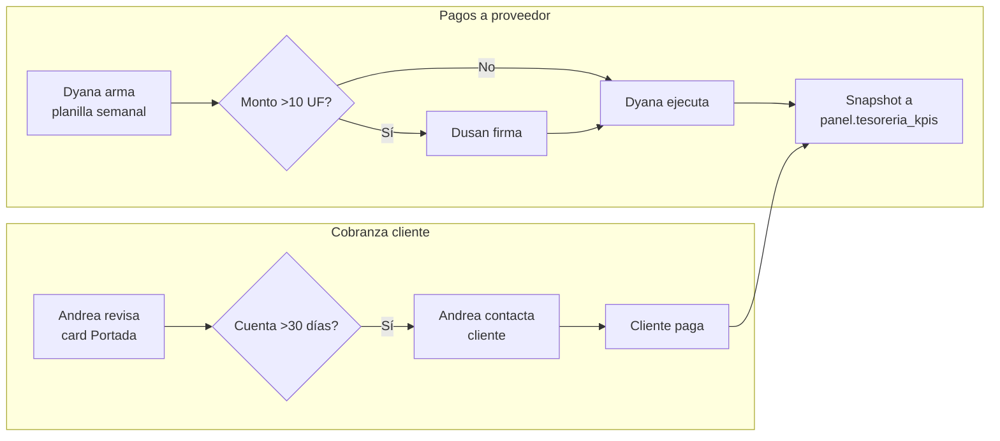
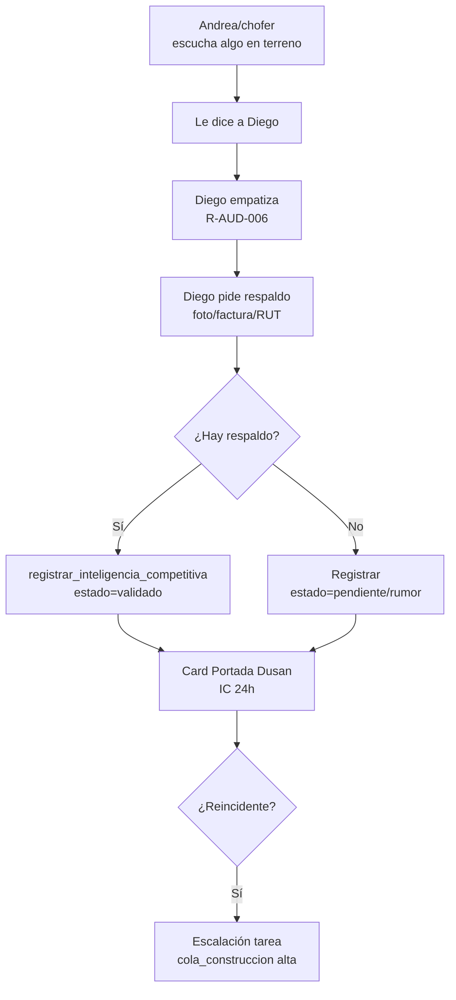

# Manual Operativo del Equipo — Grupo Reciclean-Farex-SERCOT

> Versión 1.0 · 2026-05-24 madrugada · Firmado por Dusan Arancibia.
> Vinculante para los 14 trabajadores (T01-T14), los 4 PCs del mayordomo y Diego v10.13+.
> **Regla suprema:** "Todo debe calzar — un título con su tabla, un link con su destino, una secuencia con su lógica." (VISION-PANEL-RDO.md)

> ⚠️ **Nota de actualización · 2026-07-07 (Fase 2 Paso 2.4)**
> Las tablas legacy `curated.facturas` y `curated.facturas_portal` fueron droppeadas. La arquitectura real de facturación evolucionó desde 24-jun-2026 (D-FACTURACION-ETAPA-1-001):
> - **Facturas de compra** viven en `curated.facturacion_raw` (scraper `facturacion-cl-scraper`).
> - **Facturas emitidas (ventas)** viven en `curated.facturacion_emitida_raw`.
> - **Vista canónica unificada**: `curated.facturas_todas` (UNION con columna `origen='compra'|'venta'`).
> - **Cobranza Andrea**: `panel.v_andrea_cobranza` sobre `facturas_todas WHERE origen='venta'`.
> - Existe una vista shim `curated.facturas_todas` (WHERE origen='venta') que mapea `facturacion_emitida_raw` para preservar compatibilidad con 20 tools de Diego IA. Será eliminada tras refactor de esas tools.
> - El tab "🧾 Facturación S5" fue reducido: preserva Cruce DTE y Top Clientes, se eliminó el upload manual CSV/JSON.
> - Post-Fase 3 (07-jul-2026): las 20 tools de Diego IA ya apuntan al layer canónico `curated._facturas_venta_view` (facturas_todas WHERE origen='venta'). La vista shim `curated.facturas` fue eliminada (mig 353b).
> - El trigger `curated.facturacion_emitida_raw_auto_privada` (mig 354) marca automáticamente privada=true en ventas a personas naturales (RUT<10M) para compliance Ley 21.719, espejo del trigger de compras.

---

## ÍNDICE

1. [Cómo leer este manual](#cómo-leer-este-manual)
2. [Matriz RACI · procesos × personas](#matriz-raci-procesos--personas)
3. [11 procesos × 6W (qué/quién/dónde/cuándo/por qué/cómo)](#procesos-6w)
4. [14 perfiles operativos × responsabilidades clave](#perfiles-operativos)
5. [Gaps sin sistematizar (lo que hoy es manual)](#gaps)
6. [Workflow diario por persona (mañana / tarde / cierre)](#workflow-diario)

---

## CÓMO LEER ESTE MANUAL

**6W:**
- **WHAT** — el documento / acción concreta.
- **WHO** — persona(s) responsable(s) por nombre (T01-T14).
- **WHERE** — sucursal + sistema (tab del panel + tabla Supabase + EF).
- **WHEN** — frecuencia (tiempo real / diario / semanal / mensual / por evento).
- **WHY** — la razón de negocio o legal (link a ley aplicable cuando corresponda — R-AUD-029).
- **HOW** — los pasos concretos.

**RACI:**
- **R** = Responsible (lo hace).
- **A** = Accountable (responde si falla).
- **C** = Consulted (opina antes).
- **I** = Informed (se le avisa después).

---

## MATRIZ RACI · procesos × personas

| Proceso | Dusan T01 | Pablo T02 | Andrea T11 | Cony (SERCOT) | Ingrid T04 | Dyana T14 | Cesar T13 | Jair T12 | Choferes T08/T09/T10 | Operarios T03/T05/T06/T07 |
|---|---|---|---|---|---|---|---|---|---|---|
| Cotización + cierre comercial | A | I | **R** | I | I | I | — | I | — | I |
| Negocio expedicionario (alta) | A | — | **R** | C | I | I | — | — | I | I |
| Planificación viaje + chofer | A | — | C | C | **R** Talca · Cony Maipú/Cerrillos | I | — | — | I (ejecuta) | I (carga) |
| Pesaje origen / destino | A | — | I | C | C | I | — | — | **R** (operativo) | **R** (planta) |
| Guía despacho emitida | A | — | C | C | **R** | I | — | — | I | I |
| Factura compra (proveedor) | A | — | I | — | C | **R** | — | — | — | — |
| Factura venta (cliente) | A | — | C | — | C | **R** | — | I | — | — |
| Nota de crédito | **A** firma | — | C | — | I | **R** | — | — | — | — |
| Pago a proveedor | **A** firma | — | I | — | C | **R** | — | — | — | — |
| Cobranza cliente | A | — | **R** | — | C | C | — | I | — | — |
| Rendición dinero equipo | A | — | I | — | C | **R** Dyana revisa | — | — | I (rinde) | I (rinde) |
| RDO diario MMA (Ley REP) | **A** | I | I | — | **R** Talca · **R** Cerrillos | C | **R** sistema | C | I | C |
| Liquidación sueldo (mensual) | A | — | I | — | I | **R** SERCOT | — | I | I | I |
| Asistencia turno | C | — | — | C | **R** Talca | I | — | I | **R** | **R** |
| Costos fijos / variables | **A** | I | I | C | C | **R** | — | C | — | — |
| Cierre mes (financiero) | **A** firma | I | C | — | C | **R** | I | — | — | — |
| Informe MMA / SMA | **A** firma | I | I | — | C | **R** consolida | C | — | — | — |
| Informe SII (F29 / F22) | **A** firma | — | — | — | — | **R** SERCOT | — | — | — | — |
| Inteligencia competitiva | **A** | I | **R** | — | I | — | — | I | — | — |
| Despliegues panel + EF | **A** firma | **R** | — | — | — | — | C | — | — | — |
| Soporte IT panel | I | **R** | — | — | I | — | C | I | I | I |
| Cumplimiento legal (5 leyes) | **A** | C | I | C | I | **R** REP + Laboral + SII | — | I | — | — |

---

## PROCESOS 6W

### 1. COTIZACIÓN + CIERRE COMERCIAL

| 6W | Detalle |
|---|---|
| **WHAT** | Cotización de retiro de material (compra a generador o venta a valorizador) → cierre con cliente. |
| **WHO** | **Andrea Rivera (T11)** ejecuta. Dusan (T01) firma cotizaciones >100 UF o con margen <10%. |
| **WHERE** | Panel tab **Cotizador** + **Cartera** + **Oportunidades**. Tablas: `curated.f_evaluar_retiro` (RPC), `curated.oportunidades`, `panel.v_cliente_360_full` (vista nueva mig 069). |
| **WHEN** | Tiempo real — cada vez que llega un lead (WhatsApp Andrea +56961596938, llamada, email `servicios@`). |
| **WHY** | Aceptar negocio sin margen = pérdida directa. `f_evaluar_retiro` calcula brecha UF en 2 segundos → decisión sí/no objetiva. |
| **HOW** | (1) Andrea entra al tab Cotizador. (2) Ingresa km + kg + material. (3) RPC devuelve ranking vehículo + decisión. (4) Si decisión=ACEPTAR → registra oportunidad en `curated.oportunidades`. (5) Si decisión=NEGOCIAR → escala a Dusan vía Diego "Bandeja Dusan". (6) Cierre → cambia `estado` de la oportunidad a `cerrada`. |



### 2. NEGOCIO EXPEDICIONARIO (alta)

| 6W | Detalle |
|---|---|
| **WHAT** | Crear el contrato operativo: cliente × material × frecuencia × zonas → genera viajes recurrentes. |
| **WHO** | **Andrea (T11)** crea el alta tras cerrar comercialmente. Cony (SERCOT) valida datos administrativos. |
| **WHERE** | Tab **Negocios** del panel. Tabla `curated.negocio_expedicionario` (+ `_componente` + `_proyeccion`). |
| **WHEN** | Por evento — al cerrar cada oportunidad nueva. |
| **WHY** | Sin negocio dado de alta, no se pueden planificar viajes ni emitir guías. |
| **HOW** | Pendiente form CREATE en panel (gap — hoy se hace via SQL o Excel). Mientras: Andrea pega los datos en `panel.diego_bandeja` con tipo=`alta_negocio`, Dyana o Pablo lo cargan. |



### 3. PLANIFICACIÓN DE VIAJE + ASIGNACIÓN DE CHOFER

| 6W | Detalle |
|---|---|
| **WHAT** | Programar 1 viaje específico (fecha, chofer, vehículo) sobre un negocio expedicionario. |
| **WHO** | **Ingrid Cancino (T04)** en Talca. **Cony (SERCOT)** en Maipú/Cerrillos. |
| **WHERE** | Tabla `curated.viaje_expedicionario`. Choferes asignables: `panel.conductores` (T08 Braniff Maipú · T09 Cordero Talca · T10 Valenzuela Talca). |
| **WHEN** | Semanal — los lunes se planifican los viajes de la semana. Reactivo si entra retiro urgente. |
| **WHY** | Optimizar uso de flota + cumplir Ley 18.290 (licencia vigente, peso máx, restricción RM). |
| **HOW** | (1) Ingrid filtra negocios "pendiente programar" en tab Negocios. (2) Verifica licencia chofer en `panel.conductores`. (3) Crea fila en `viaje_expedicionario` con `fecha_planificada`, `oferente_transporte_id`. (4) Notifica al chofer **por WhatsApp directo** (R-AUD-028 — los 3 choferes son canal WhatsApp). (5) Diego puede orquestar con tool futuro `enviar_whatsapp`. |

### 4. PESAJE ORIGEN / DESTINO

| 6W | Detalle |
|---|---|
| **WHAT** | Registrar el peso bruto+tara=neto del material en báscula al cargar (origen) y descargar (destino). |
| **WHO** | **Operarios planta** (T03 Nicolás Cerrillos, T07 Carlos Iturra Maipú, T06 Cristian Montecinos Talca). **Choferes** (T08/T09/T10) confirman vía WhatsApp si están solos. |
| **WHERE** | Báscula CMR física → CSV → `staging.pesajes` → `curated.pesajes`. Tab **Pesaje S1** del panel. |
| **WHEN** | Tiempo real — cada vez que un camión cruza la báscula. |
| **WHY** | Ley REP 20.920 Art. 32 (trazabilidad MERR). Base para facturación. Detecta mermas anómalas. |
| **HOW** | (1) Báscula imprime ticket. (2) Operario carga ticket a `staging.pesajes` via tab Pesaje > Subir CSV. (3) PC Cámaras hace ETL diario a `curated.pesajes`. (4) Si la merma > 5%, alerta automática en `panel.diego_bandeja` para Ingrid + Dusan. (5) `viaje_expedicionario.peso_origen_kg` y `peso_destino_kg` se actualizan. |



### 5. GUÍA DE DESPACHO (DTE)

| 6W | Detalle |
|---|---|
| **WHAT** | DTE electrónico emitido por SII en cada movimiento de material (compra al generador o venta al valorizador). |
| **WHO** | **Ingrid (T04)** emite en Talca. **Cony (SERCOT)** emite en RM. |
| **WHERE** | Sistema externo SII Maipo / OpenFactura (no integrado al panel hoy). Tabla `curated.guias_despacho` recibe los datos post-emisión. |
| **WHEN** | Por cada viaje — máximo 1 hora después del pesaje origen. |
| **WHY** | Ley REP Art. 32 (trazabilidad). Ley 18.290 Art. 86 (documentación a bordo). Sin guía = riesgo retiro de circulación + multa SMA. |
| **HOW** | (1) Después del pesaje, Ingrid/Cony emite DTE en sistema SII. (2) PDF + XML se cargan a `curated.guias_despacho` (manual hoy, ETL futuro). (3) Folio queda vinculado al `viaje_id`. (4) Si tipo=venta → cliente receptor + monto. Si tipo=compra → proveedor + monto. |

### 6. FACTURA DE COMPRA (proveedor → Reciclean)

| 6W | Detalle |
|---|---|
| **WHAT** | DTE recibido del generador/proveedor que vende material a Reciclean (chatarra, cartón, etc.). Farex es retenedor IVA 19%. |
| **WHO** | **Dyana Pinto (T14)** SERCOT. Cony Maipú/Cerrillos completa registro físico. |
| **WHERE** | SII → `staging.dte_clientes` → `curated.facturas_todas` (WHERE origen='venta'). Tab **Facturación S5** del panel (visible solo a comercial+admin+dusan). |
| **WHEN** | Diario — Dyana descarga DTEs del día siguiente hábil. |
| **WHY** | Cumplimiento SII (Art. 17 DTE electrónica obligatoria). Farex retiene IVA Art. 29. Base para PPM mensual F29. |
| **HOW** | (1) Generador emite factura/guía vía SII. (2) DTE entra a `staging.dte_clientes` por sync diario SII (cron + EF). (3) Dyana valida y promueve a `curated.facturas_todas` (WHERE origen='venta'). (4) Si Farex retiene IVA, registra retención en F29. (5) Pago al proveedor se programa según condiciones (30/60/90 días). |

### 7. FACTURA DE VENTA (Reciclean → cliente final)

| 6W | Detalle |
|---|---|
| **WHAT** | DTE emitido por Reciclean/Farex al valorizador final (FPC, HUAL, etc.) por venta del material recuperado. |
| **WHO** | **Dyana (T14)** emite. Andrea (T11) confirma datos del cliente + monto. |
| **WHERE** | Sistema SII externo → DTE registrado en `curated.facturas_todas` (WHERE origen='venta'). Tab **Facturación S5**. |
| **WHEN** | Por cada venta — máximo 24h después de despacho. |
| **WHY** | Cumplimiento SII + cobranza programada. |
| **HOW** | (1) Andrea confirma con cliente cantidad + precio. (2) Dyana emite DTE. (3) Folio se carga a `curated.facturas_todas` (WHERE origen='venta') con `tipo=venta`. (4) Cobranza queda en `panel.tesoreria_kpis.por_cobrar_clp`. |

### 8. NOTA DE CRÉDITO

| 6W | Detalle |
|---|---|
| **WHAT** | DTE que anula o ajusta una factura previa (devolución, ajuste de peso, error). |
| **WHO** | **Dyana (T14)** emite. **Dusan (T01) firma autorización** si el monto > 1 UF (R6 confirmación irreversibles). |
| **WHERE** | SII → `curated.facturas_todas` (WHERE origen='venta') con `tipo='nota_credito'` y referencia al folio original. |
| **WHEN** | Por evento — cuando hay reclamo del cliente o error detectado. |
| **WHY** | Corregir un DTE emitido por error sin alterar el original (Art. 17 Código Tributario). |
| **HOW** | (1) Andrea o el cliente detectan el error. (2) Andrea registra en `panel.diego_bandeja` con tipo=`solicitud_nc`. (3) Diego avisa a Dusan para firma (R-AUD-029 + R6). (4) Dusan aprueba → Dyana emite NC. (5) Folio NC se vincula al folio original. |

### 9. PAGO A PROVEEDOR / COBRANZA

| 6W | Detalle |
|---|---|
| **WHAT** | Salida bancaria al proveedor (compra material o servicio) y entrada bancaria por cobranza a cliente. |
| **WHO** | **Dyana (T14)** gestiona ambos. **Dusan (T01) firma** transferencias >10 UF. **Andrea (T11)** hace seguimiento de cobranza. |
| **WHERE** | Banco externo (no integrado al panel). Resumen agregado en `panel.tesoreria_kpis` (1 snapshot por día). |
| **WHEN** | Pagos: programados según condiciones del proveedor (típico 30 días). Cobranza: seguimiento semanal por Andrea. |
| **WHY** | Mantener capital de trabajo + cumplir compromisos + evitar atraso intereses moratorios. |
| **HOW** | (1) Dyana arma planilla pagos semanal. (2) Dusan firma. (3) Dyana ejecuta transferencias. (4) Carga snapshot del saldo banco a `panel.tesoreria_kpis.saldo_banco_clp` (manual hoy, automatizable con API bancaria futura). (5) Andrea sigue las cuentas por cobrar `>30 días` en card Portada. |



### 10. RENDICIÓN DE DINERO DEL EQUIPO

| 6W | Detalle |
|---|---|
| **WHAT** | Comprobante de gasto operativo (combustible, peajes, comida en ruta) que el equipo rinde a tesorería. |
| **WHO** | **Operarios + choferes** rinden. **Dyana (T14)** valida + calza. |
| **WHERE** | Tabla `panel.rendiciones`. Diego tiene tool `registrar_rendicion(persona_email, monto_clp, motivo, factura_url)`. |
| **WHEN** | Tiempo real — el operario sube la boleta vía Diego desde su celular. |
| **WHY** | Trazabilidad gastos + auditoría + reembolso correcto. Sin rendición → descuento del sueldo. |
| **HOW** | (1) Operario foto boleta → mensaje WhatsApp a Diego ("rindo $5.000 combustible camión Talca"). (2) Diego invoca `registrar_rendicion` → fila en `panel.rendiciones` con `factura_url` Storage. (3) Dyana revisa en tab Rendiciones, valida, marca `estado=calzado`. (4) Si diferencia >5% entre `monto_clp` y `factura_monto_clp`, alerta. (5) Diego también consulta `rendiciones_pendientes_por_persona` cuando alguien pregunta "¿cuánto debo rendir?". |

### 11. RDO DIARIO MMA (Ley REP)

| 6W | Detalle |
|---|---|
| **WHAT** | Reporte Diario de Operaciones (RDO) — formato MMA con kg recolectados, valorizados, eliminados por material. |
| **WHO** | **Ingrid (T04)** Talca + **Cony** RM consolidan. **Dyana (T14)** revisa antes de envío. **Dusan (T01)** firma envío. **Cesar (T13)** sistema lo arma. |
| **WHERE** | EF `rdo-builder` (cron diario) → tabla `curated.rdo_diario` → enviado por email al MMA. Tab **RDO Resumen**. |
| **WHEN** | Diario — 8:00 CLT cron arma; 12:00 humano valida; 16:00 envío MMA. Consolidado mensual día 15 mes siguiente. |
| **WHY** | Ley REP 20.920 Art. 22 (RETC). Multa hasta 10.000 UTM por omisión o falseo. |
| **HOW** | (1) Cron EF consolida pesajes del día por material × sucursal. (2) Resultado a `curated.rdo_diario` con `email_texto` armado. (3) Card Portada muestra estado RDO. (4) Ingrid/Cony validan en tab RDO. (5) Dusan firma → flag `enviado_email=true`. (6) PDF + XML enviado al MMA. |

### 12. LIQUIDACIÓN DE SUELDO MENSUAL

| 6W | Detalle |
|---|---|
| **WHAT** | Cálculo de remuneración mensual + cotizaciones (AFP, salud, seguro) + impuestos + liquidación física. |
| **WHO** | **Dyana (T14)** SERCOT externa. Cony entrega novedades del mes (horas extra, ausencias, bonos). |
| **WHERE** | Sistema SERCOT externo. Datos canónicos en `curated.trabajadores` (sueldo_liquido_clp + costo_total_empresa_clp). |
| **WHEN** | Mensual — día 25 cierre; día último liquidación + pago. |
| **WHY** | Código del Trabajo Art. 22 (remuneración). Ley 16.744 (cotizaciones obligatorias). |
| **HOW** | (1) Cony envía a Dyana por WhatsApp/email las novedades del mes (días trabajados, horas extra, ausencias). (2) Dyana calcula en SERCOT. (3) Genera liquidación PDF + ZIP a cada trabajador. (4) Pago vía transferencia bancaria. (5) Actualiza `curated.trabajadores.sueldo_liquido_clp` solo si hay reajuste. |

### 13. ASISTENCIA / TURNOS

| 6W | Detalle |
|---|---|
| **WHAT** | Registro de entrada/salida del personal operativo + control de horas extra. |
| **WHO** | **Operarios** marcan. **Ingrid (T04)** y Cony supervisan. |
| **WHERE** | **NO sistematizado hoy.** Tabla pendiente: `panel.asistencias` (no existe). Hoy se hace por WhatsApp del grupo de sucursal. |
| **WHEN** | Tiempo real — cada inicio + cierre de turno. |
| **WHY** | Código del Trabajo Art. 22 (jornada máx 45h/sem). Calcular horas extra. Detectar ausentismo. |
| **HOW** | **Hoy (manual):** WhatsApp grupal de sucursal con foto del trabajador al ingresar. **Propuesta:** tab Asistencia en panel con check-in vía Diego ("entré a trabajar Talca 8:15") → tabla nueva `panel.asistencias` (codigo_trabajador, fecha, entrada, salida, sucursal). Pendiente Pablo. |

### 14. COSTOS FIJOS / VARIABLES

| 6W | Detalle |
|---|---|
| **WHAT** | Catálogo de gastos recurrentes (arriendo, servicios) y variables (combustible, repuestos). Base para cierre mes. |
| **WHO** | **Dyana (T14)** mantiene. Dusan (T01) aprueba altas >5 UF/mes. |
| **WHERE** | `curated.costos_fijos`, `curated.costos_variables`, vistas `vw_costos_*_vigente` + `vw_estructura_costos_mensual`. |
| **WHEN** | Costos fijos: revisión mensual. Variables: registro por evento. |
| **WHY** | Visibilidad de margen real por sucursal + decisiones de optimización. |
| **HOW** | Dyana mantiene catálogo. La vista `vw_estructura_costos_mensual` agrega para card "Costos por Sucursal" en tab Cierres. |

### 15. CIERRE MES + INFORMES EXTERNOS

| 6W | Detalle |
|---|---|
| **WHAT** | Cierre contable mensual + 3 informes externos: F29 SII, RDO Mensual MMA, Liquidaciones DT. |
| **WHO** | **Dyana (T14)** ejecuta los 3. **Dusan (T01) firma envíos**. |
| **WHERE** | `curated.cierres`, `vw_cierre_mes_actual`. Externos: SII (F29), MMA (RDO consolidado), DT (sin tabla específica). |
| **WHEN** | Mensual — día 5 cierre; día 12 F29 + PPM SII; día 15 RDO MMA; día último liquidaciones. |
| **WHY** | Cumplimiento legal (R-AUD-029): SII Art. 84 (PPM mensual día 12); REP Art. 22 (RDO 15 mes siguiente). |
| **HOW** | (1) Día 1-5: Dyana cierra contable. (2) Día 5-12: arma F29 con DTEs + retenciones. (3) Día 12 sube SII. (4) Día 15: consolida RDO mes desde `curated.rdo_diario`. (5) Dusan firma. (6) Día último: liquidaciones + transferencias sueldos. |

### 16. INTELIGENCIA COMPETITIVA

| 6W | Detalle |
|---|---|
| **WHAT** | Registro de info de competidores (SOREPA, CMPC, otros) — precios, zonas, nuevos jugadores. |
| **WHO** | **Andrea (T11)** y choferes (T08/T09/T10) reportan. Dusan (T01) decide acciones. |
| **WHERE** | `curated.inteligencia_competitiva` + `panel.inteligencia_competitiva`. Diego tool `registrar_inteligencia_competitiva`. |
| **WHEN** | Tiempo real — cuando alguien escucha algo en terreno. |
| **WHY** | Detectar amenazas antes que se materialicen + ajustar precios + escalar a Dusan. |
| **HOW** | (1) Andrea o chofer le dice a Diego: "Vi camión SOREPA en planta Pincore". (2) Diego ejecuta flujo IC: empatiza → pide respaldo (foto/factura) → registra. (3) Card portada Dusan: "Inteligencia competitiva 24h" + escalación si reincidente. |



### 17. CUMPLIMIENTO LEGAL (R-AUD-029)

| 6W | Detalle |
|---|---|
| **WHAT** | Estado de cumplimiento por artículo de las 5 leyes que rigen al grupo (REP, Datos, Tránsito, SII, Laboral). |
| **WHO** | **Dyana (T14)** verifica los 20 artículos con obligación directa. **Dusan (T01)** firma estado. |
| **WHERE** | `panel.leyes_aplicables` (5) + `panel.articulos_ley` (25) + `panel.cumplimiento_legal` (20) + `panel.v_cumplimiento_legal` (dashboard). |
| **WHEN** | Mensual — Dyana actualiza estado por artículo. Diario para artículos con plazo (ej: licencia chofer, MERR). |
| **WHY** | Multas potenciales por las 5 leyes: hasta $1.400M (Datos) + $700M (REP) + cárcel SII (delitos graves). |
| **HOW** | Diego es vocero — responde con artículo exacto + autoridad + sanción. Si detecta incumplimiento, registra en `panel.cumplimiento_legal` con `estado='incumplido'` y avisa a Dusan. |

### 18. RECEPCIÓN MATERIAL DE TERCEROS (V2)

| 6W | Detalle |
|---|---|
| **WHAT** | Material que llega a planta sin retiro previo (un tercero lo TRAE). |
| **WHO** | Operario planta (T03/T05/T06/T07) recibe + identifica. Ingrid (T04) / Cony aprueban montos. |
| **WHERE** | Báscula entrada + tab Pesaje + `staging.pesajes.origen='recepcion_terceros'`. Tabla complementaria pendiente: `curated.actas_recepcion_terceros` (mig pendiente). |
| **WHEN** | Horario recepción planta (8:00-18:00 lunes-sábado). |
| **WHY** | Sin esta línea el material entra "fantasma" — sin trazabilidad MERR (viola Ley REP Art. 32). Hoy existe en práctica pero no está sistematizado. |
| **HOW** | (1) Camión 3ro entra → operario identifica + RUT + tipo material → (2) **Acta recepción terceros** firmada (formato físico hoy, digital pendiente) → (3) Pesaje báscula → (4) Ticket pesaje origen=`tercero` → (5) Tipo: compra / donación / depósito gratuito → (6) DTE: factura compra o Declaración Donación. |

### 19. PREFACTURA (V2)

| 6W | Detalle |
|---|---|
| **WHAT** | Documento preliminar entre cierre comercial y emisión DTE definitivo, con cantidad estimada × precio acordado. |
| **WHO** | **Andrea (T11)** genera tras cerrar comercial. **Dyana (T14)** la promueve a factura formal una vez pesada. |
| **WHERE** | **Tabla nueva pendiente:** `curated.prefacturas` (spec en `BANDEJA-PABLO-PREFACTURAS-PAGOS.md` mig 070). |
| **WHEN** | Entre cierre comercial y emisión DTE definitivo. Típicamente 1-3 días hábiles. |
| **WHY** | Permite al cliente/proveedor ver el monto estimado ANTES del DTE, validar, evitar la mayoría de notas de crédito. Reduce fricción cobranza. |
| **HOW** | (1) Andrea cierra → INSERT `curated.prefacturas`. (2) Pesaje real planta destino. (3) Si `delta <= 5%` → promueve a DTE con cantidad real. (4) Si `delta > 5%` → ajuste o nota de crédito. |

### 20. PLANIFICACIÓN VIAJE + CHOFER (V2)

| 6W | Detalle |
|---|---|
| **WHAT** | Asignar chofer + vehículo + fecha al viaje específico que va a hacer el retiro. |
| **WHO** | **Ingrid (T04)** en Talca · **Cony (SERCOT)** en Maipú/Cerrillos. |
| **WHERE** | `curated.viaje_expedicionario` (`oferente_transporte_id`, `fecha_planificada`). Lista de choferes: `panel.conductores` (T08 Braniff Maipú · T09 Cordero Talca · T10 Valenzuela Talca). |
| **WHEN** | Semanal (lunes planifica semana) + reactivo si entra urgente. |
| **WHY** | Sin asignación explícita el chofer no sabe qué viaje le toca + no se cumple Ley 18.290 (verificar licencia vigente). |
| **HOW** | (1) Ingrid filtra negocios "pendiente programar". (2) Verifica licencia en `panel.conductores`. (3) Crea fila en `viaje_expedicionario`. (4) **Notifica chofer por WhatsApp directo** (R-AUD-027). (5) Diego v10.13 puede orquestar con tool `enviar_whatsapp` (pendiente Pablo). |

### 21. RECHAZO / DEVOLUCIÓN DESTINO FINAL (V2)

| 6W | Detalle |
|---|---|
| **WHAT** | Cliente final rechaza el material entregado (calidad fuera de spec, contaminación, peso menor). |
| **WHO** | Cliente reporta → Andrea (T11) recibe → escala Dusan (T01) → Dyana (T14) emite NC. |
| **WHERE** | `curated.viaje_expedicionario.estado='rechazado'` + `curated.facturas_todas` (WHERE origen='venta') tipo='nota_credito' + `panel.diego_bandeja` tarea Dusan. |
| **WHEN** | Por evento (típicamente <48h después de despacho). |
| **WHY** | Sin flujo de devolución, la facturación queda inflada + el material queda "perdido" en libros. |
| **HOW** | (1) Cliente rechaza → Andrea recibe. (2) `panel.diego_bandeja` tipo='rechazo_destino_final' + foto evidencia. (3) Diego escala a Dusan firma. (4) Dyana emite NC reverso. (5) Si material vuelve: nuevo viaje `estado='retorno'`. (6) Tarea Dusan: revisar causa raíz planta origen. |

### 22. PAGO PROVEEDOR (V2)

| 6W | Detalle |
|---|---|
| **WHAT** | Egreso bancario al proveedor por compra de material (chatarra, cartón, etc.) o por servicio (peoneta, jaulas, transporte externo). |
| **WHO** | **Dyana (T14)** prepara planilla pagos semanal. **Dusan (T01) firma** transferencias > 10 UF. |
| **WHERE** | **Tabla nueva pendiente:** `curated.pagos_emitidos` (spec en `BANDEJA-PABLO-PREFACTURAS-PAGOS.md` mig 070). Hoy solo agregado en `panel.tesoreria_kpis.pagos_programados_clp`. |
| **WHEN** | Semanal (martes Dyana prepara, miércoles Dusan firma, jueves transferencia). |
| **WHY** | Mantener capital trabajo + cumplir compromisos proveedores + evitar intereses moratorios + auditoría SII. |
| **HOW** | (1) Dyana arma planilla desde `curated.facturas_todas` (WHERE origen='venta') tipo='compra' + estado='pendiente_pago'. (2) Dusan firma. (3) Dyana ejecuta transferencias. (4) INSERT `curated.pagos_emitidos` por cada egreso. (5) UPDATE `curated.facturas_todas` (WHERE origen='venta') estado='pagado'. (6) Card "Egresos semana" en Portada Dusan. |

### 23. CIERRE VIAJE + RDO + RETC (V2)

| 6W | Detalle |
|---|---|
| **WHAT** | Cierre formal del viaje cuando todos los pesajes + facturas + pagos están conciliados. Cálculo de margen real. Reporte RDO diario al MMA (RETC). |
| **WHO** | **Dyana (T14)** cierra viaje contable. **Ingrid + Cony** consolidan RDO sucursal. **Dusan (T01) firma** envío MMA. **Cesar (T13)** sistema cron lo arma. |
| **WHERE** | `curated.viaje_expedicionario.margen_real_clp` + `curated.rdo_diario` + EF `rdo-builder` (cron 8:00 CLT). |
| **WHEN** | Diario para RDO (8:00 cron + 12:00 humano valida + 16:00 envío MMA). Mensual día 15 para RDO consolidado MMA. |
| **WHY** | Ley REP Art. 22 (RETC) — multa hasta 10.000 UTM por omisión. Cierre viaje permite calcular margen real por sucursal × material × cliente. |
| **HOW** | (1) Diario 8:00 cron EF consolida. (2) `curated.rdo_diario` con `email_texto` armado. (3) Ingrid/Cony validan en tab RDO. (4) Dusan firma → `enviado_email=true`. (5) Día 15: RDO mes al MMA + planilla RETC. (6) Por cada viaje cerrado: `margen_real_clp = ingreso - costos_logistica - costos_estadia`. (7) Cierre 360 = viaje + factura + cobranza + pago todos OK. |

---

## PERFILES OPERATIVOS

### T01 — Dusan Arancibia (CEO)

**Foco diario:** firmar decisiones, escalar inteligencia competitiva, validar cierres mensuales.
**Tabs panel:** Portada (KPIs + decisiones pendientes) + Cumplimiento Legal + Bandeja Diego + Admin.
**Diego usage:** consulta facturación, márgenes, alertas. Recibe "Bandeja Diego" priorizada.
**No hace operativo** (rinde tareas a delegados).

### T02 — Pablo Arancibia (Tech Lead)

**Foco:** deploy EF + frontend panel + DDL + soporte IT.
**Tabs:** todos (admin) + tab Admin con permisos especiales.
**Tools:** Supabase CLI, GitHub, Vercel. Único autorizado a `supabase functions deploy`.

### T03 — Dusan Nicolás Arancibia (operativo Cerrillos)

**Foco:** operación planta Cerrillos (carga descarga, pesaje, prensa).
**Tabs:** Portada + Pesaje + Operaciones Día.
**Diego:** rinde gastos vía Diego desde celular. Reporta incidencias.

### T04 — Ingrid Cancino (admin Talca)

**Foco:** consolidar Talca — planificación viajes + emisión guías + RDO Talca + supervisión.
**Tabs:** todos los operativos + Cierres + RDO.
**Diego:** orquesta el día Talca, asigna tareas a T06/T09/T10.

### T05 — Juan Mendoza (operativo + jefe Maipú)

**Foco:** operación planta Maipú + jefatura operativa + apoyo comercial puntual.
**Tabs:** Pesaje + RDO + Operativos.

### T06 — Cristian Montecinos (operativo Talca)

**Foco:** operación planta Talca + pesaje.
**Tabs:** Pesaje + Operaciones Día.

### T07 — Carlos Iturra (operativo Maipú)

**Foco:** operación planta Maipú + pesaje.
**Tabs:** Pesaje + Operaciones Día.

### T08 — Andrés Braniff (chofer Maipú)

**Foco:** transporte Maipú-clientes. Licencia A2.
**Canal:** WhatsApp directo (no email, no panel).
**Reporta a:** Cony (Maipú/Cerrillos).
**Sin acceso panel** — todo via Diego WhatsApp futuro.

### T09 — Victor Cordero (chofer Talca, grúa)

**Foco:** transporte Talca + grúa 100%.
**Canal:** WhatsApp directo.

### T10 — Cristian Valenzuela (chofer Talca)

**Foco:** transporte Talca, ambos camiones Talca (restricción: no simultáneo).
**Canal:** WhatsApp directo.

### T11 — Andrea Rivera (comercial)

**Foco:** cotización + cierre + cobranza + inteligencia competitiva.
**Tabs:** Cartera + Oportunidades + Cotizador + Negocios + Precios + Facturación + Entregables + Bandeja Diego.
**Diego:** orquesta clientes, recibe alertas "clientes sin contacto >30d", registra inteligencia.

### T12 — Jair Sanmartín (asistente)

**Foco:** administración transversal + permisología.
**Tabs:** Admin (admin perfil).

### T13 — Cesar Mora (IT externo, honorarios)

**Foco:** soporte IT + chequeos sistemas Diego (smoke test 8:30 CLT).
**Tabs:** Admin + Bandeja Diego.

### T14 — Dyana Pinto (contabilidad SERCOT)

**Foco:** facturación + cobranza + pagos + sueldos + cierres + informes externos + cumplimiento legal (los 20 artículos).
**Tabs:** Facturación + Cierres + Cumplimiento Legal.
**Canal:** WhatsApp directo (no email panel). Trabaja desde SERCOT externa.

### Cony (Constanza SERCOT externa — pendiente formalizar R-AUD-024)

**Foco:** operación RM (Maipú + Cerrillos) + RRHH novedades mensuales + supervisión.
**Acceso panel:** vía `contador4@sercotspa.cl` (perfil externo).
**Pendiente:** Dusan firma si entra como T15 oficial en `curated.trabajadores`.

---

## GAPS — Lo que NO está sistematizado hoy

| Gap | Impacto | Prioridad | Cómo cerrarlo |
|---|---|---|---|
| Asistencia / turnos | Sin control de horas extra | Alta | Tabla `panel.asistencias` + Diego tool `marcar_asistencia(trabajador_id, entrada/salida)` |
| Form CREATE negocio expedicionario | Andrea no puede dar de alta solo | Alta | Drawer en tab Negocios + form (Pablo 30 min) |
| Form CREATE viaje | Ingrid no puede planificar solo | Alta | Drawer en tab Negocios + asignación chofer (Pablo 1h) |
| Emisión DTE (factura/NC/guía) | Manual en SII externo | Media | Integración OpenFactura o Toku — eval costo |
| Liquidación sueldo | Manual SERCOT, sin sync al panel | Media | Sync mensual SERCOT → `curated.liquidaciones` (tabla pendiente) |
| Pago bancario | Manual + snapshot diario | Media | API banco (BCI/Santander) — eval factibilidad |
| Cobranza pipeline visual | Andrea no ve el aging visual | Media | Card "Por cobrar 30/60/90+" en Portada Andrea |
| `Cony` formalización | Aparece en flujos pero sin registro canónico (R-AUD-024) | Media | Decisión Dusan: agregar a `curated.trabajadores` como T15 o documentar como contacto SERCOT |
| Notificación WhatsApp saliente Diego | Diego no puede mandar mensajes proactivos | Media | Tool `enviar_whatsapp` en EF + endpoint POST (BANDEJA-PABLO existente) |

---

## WORKFLOW DIARIO POR PERSONA

### Dusan (T01) — CEO

```
08:30 Login panel → Portada
      Card "Decisiones pendientes firma" (vista panel.v_diego_pendientes filtro who=dusan)
      Card "Diego health" verde/rojo
      Card "Cumplimiento legal" % por ley
12:00 Bandeja Diego → resuelve escalaciones del equipo
14:00 Tab Cierres / Inteligencia competitiva si hay alerta
17:00 Reporte Andrea (cierres del día comercial) vía WhatsApp
```

### Andrea (T11) — Comercial

```
08:30 Portada → "Clientes sin contacto >30d" + "Oportunidades calientes"
09:00 Llamadas / WhatsApp clientes (cotizar)
10:30 Tab Cotizador → 3-5 cotizaciones del día (f_evaluar_retiro)
12:00 Cierre comerciales → registrar oportunidades nuevas
14:00 Cobranza → tab Cartera, sigue por-cobrar 30+ días
16:00 Inteligencia competitiva (escucha en terreno)
17:00 Reporte vía Diego "Bandeja Dusan" → 3 cierres + 1 alerta
```

### Ingrid (T04) — Admin Talca

```
07:00 Llegada planta Talca, recibe choferes T09/T10
07:30 Pesaje primer camión
08:30 Login panel → tab Pesaje + Operativos Día
09:00 Planificación viajes semana (lunes)
12:00 RDO Talca día anterior validación
14:00 Emisión guías SII Talca
16:00 Cierre día → guías + pesajes contra viajes
17:30 Reporte WhatsApp Cony (RM) coordinación día siguiente
```

### Dyana (T14) — SERCOT contabilidad

```
Diario mañana: descarga DTEs día anterior desde SII → curated.facturas
Diario tarde: rendiciones equipo → tab Rendiciones validar
Semanal lunes: planilla pagos proveedores semana → firma Dusan martes
Mensual día 5: cierre contable
Mensual día 12: F29 + PPM SII
Mensual día 15: RDO MMA consolidado (con Ingrid)
Mensual día último: liquidación sueldos + pago equipo
```

### Choferes (T08/T09/T10) — Comunicación WhatsApp Diego

```
06:00 Mensaje WhatsApp a Diego: "buenos días, ¿qué viaje me toca?"
      Diego responde con viaje_id + cliente + dirección + hora
07:00 Sale a destino. En ruta avisa pesajes vía Diego.
12:00 Almuerzo + rinde combustible vía Diego foto boleta
16:00 Vuelta planta + pesaje destino
17:00 Confirma cierre día vía Diego
```

---

## REGLA DE ORO PARA TODO EL EQUIPO

**Si una persona te pide que hagas algo:**
1. Verificá si está en tu lista RACI (¿soy R o A?).
2. Si NO te corresponde, decí "no me corresponde, lo hace [X]" y derivá vía Diego.
3. Si te corresponde, ejecutalo + registralo en la tabla canónica + avisá a quien corresponda.
4. **Si no hay tabla canónica**, no improvises — escalá a Dusan y propuestá agregar el flujo.

**Si Diego no sabe algo:** dice "voy a consultar" + busca en `panel.articulos_ley` / `panel.v_cliente_360_full` / `curated.trabajadores`. **NUNCA inventa** (R-AUD-014).

---

**Firmado:** PC Dusan bajo mandato Dusan Arancibia, 2026-05-24 madrugada.
**Próxima revisión:** después de la primera semana operando con este manual (Dusan + Andrea + Ingrid + Dyana firman ajustes).
